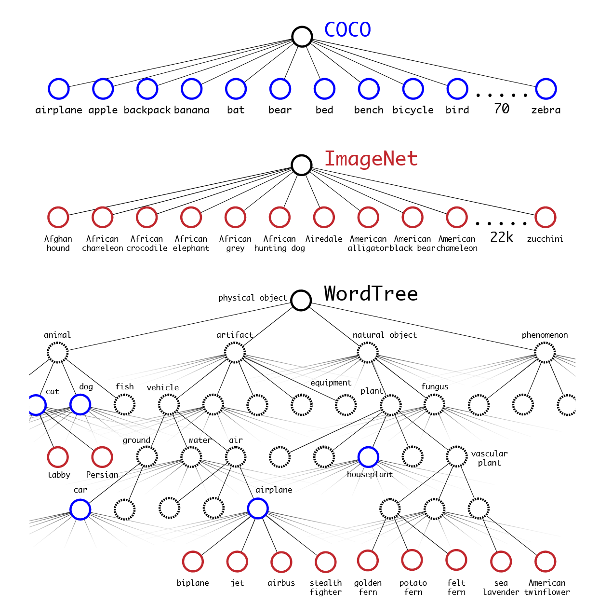

# YOLOv2 介绍
## 1. Yolov2 原理简介
相较于 YOLOv1，YOLOv2 围绕精度提升、速度保持、多类别适配三大方向做了一系列关键改进
### 1.1 锚框

#### 改进1：锚框（Anchor Boxes）
锚框是预设在特征图每个网格上的固定尺寸边框，YOLOv2 每个网格不再直接预测框的绝对尺寸，而是预测锚框的偏移量和缩放因子。每个网格预设 k 个锚框（YOLOv2 默认为 5 个）

#### 改进2：直接位置预测（Direct location prediction）
模型输出不再是直接的框坐标，而是锚框的 **x/y 偏移量**和**w/h 缩放因子**：
*  $\sigma(t_x)$ 、 $\sigma(t_y)$ 为锚框中心坐标偏移量
*  $t_w$ 、 $t_h$ 为锚框宽度、高度缩放因子

最终框坐标通过公式解码：
*  $b_x = \sigma(t_x) + c_x$ （ $c_x$ 为网格左上角 x 坐标， $\sigma(t_x)$ 限制偏移量在 0~1 之间）
*  $b_y = \sigma(t_y) + c_y$ （ $c_y$ 为网格左上角 y 坐标）
*  $b_w = p_w \cdot e^{t_w}$ （ $p_w$ 为锚框原始宽度， $t_w$ 为模型预测的宽度缩放因子）
*  $b_h = p_h \cdot e^{t_h}$ （ $p_h$ 为锚框原始高度， $t_h$ 为模型预测的高度缩放因子）

> Q：为什么要对数变换？A：平衡大小目标损失贡献

这种设计将**直接回归框尺寸**转化为**回归锚框的相对偏移**，大幅降低了回归难度，提升了框预测的稳定性。因此，输入一张图片，模型的输出为 $S \times S \times (k \times 5 + C)$，其中 $S$ 为特征图尺寸， $k$ 为每个网格预设的锚框数， $C$ 为类别数。
#### 改进3：维度聚类（Dimension Clusters）：找锚框的方法
传统锚框尺寸依赖人工经验设计（如 Faster R-CNN），YOLOv2 提出**基于 IoU 的 K-means 聚类**自动生成适配数据集的锚框：
* 从训练集中提取所有框的宽高（归一化到特征图尺寸）
* 使用k-means聚类方法选择k个锚框，兼顾召回率和模型轻量。选k=5
* 欧式距离改为 $1-IOU$ （防止大框影响过大）
<p align="center">
  
</p>
这种方法通过自动学习数据分布，无需手动设计，且能有效处理不同物体尺寸的问题。

### 1.2 网络架构
#### 改进4：使用Darknet-19（全卷积网络FCN）
相较于V1，V2改GooleNet为Darknet-19，能够提取更丰富的特征，从而提升检测精度。移除了所有全连接层，仅保留卷积层。
#### 改进5：批量归一化（Batch Normalization）
在 Darknet-19 的每一层卷积后都添加了BN层，无需 Dropout 即可有效防止过拟合（直接移除dropout）
#### 改进6：细粒度特征融合（Fine-Grained Features）
将Darknet-19中第13层卷积输出（细粒度特征）与第19层卷积输出（粗粒度特征）通过 Passthrough 层融合，保留多尺度信息。
* **passthrough层**：将26×26×512的特征图按“隔点采样”方式重塑为13×13×2048（每个2×2区域压缩为1个像素，通道数扩大4倍），再与13×13×1024的特征图拼接，得到13×13×3072的融合特征。

<p align="center">
  
</p>

由于只有卷积层，可输入不同尺寸图片（320–608，步长 32），网格数 $ S=\frac{图片尺寸}{32} $

### 1.3 损失函数

YOLOv2 损失函数和YOLOv1类似,但略有不同

$$
Loss = \lambda_{coord} \cdot Loss_{coord} + Loss_{obj} + \lambda_{noobj} \cdot Loss_{noobj} + Loss_{class}
$$
*  $\sigma(t_x)$ 、 $\sigma(t_y)$ 为锚框中心坐标偏移量, $\hat{t}_x$ 、 $\hat{t}_y$ 为模型预测的锚框中心坐标偏移量(取sigmoid前)
*  $t_w$ 、 $t_h$ 为锚框宽度、高度缩放因子， $\hat{t}_w$ 、 $\hat{t}_h$ 为模型预测的锚框宽度、高度缩放因子
*  $conf_{pred}$ 为模型预测的锚框置信度
*  $P_c$ 为 GT 框所属类别概率（0/1）， $\hat{P}_c$ 为模型预测的 GT 框所属类别概率

**一、坐标回归损失**：仅正样本参与，宽高对数变换平衡大小目标（权重5.0，强化定位精度）：

$$
Loss_{coord} = \sum \mathbb{1}^{obj} \left[( \sigma {(t_x)}-\sigma(\hat{t}_x))^2 + ( \sigma {(t_y)}-\sigma(\hat{t}_y))^2 + (t_w-\hat{t}_w)^2 + (t_h-\hat{t}_h)^2\right]
$$


**二、置信度损失**：有目标置信度预测（MSE）和无目标置信度预测（MSE）：

- 有目标：

$$Loss_{obj} = \sum \mathbb{1}^{obj} (\sigma(conf_{pred}) - IOU(pred, gt))^2$$

- 无目标（权重0.5，缓解正负样本不均衡）：

$$Loss_{noobj} = \sum \mathbb{1}^{noobj} (\sigma(conf_{pred}) - 0)^2$$

**三、类别损失**：仅正样本参与，单/多标签分别用交叉熵/BCE：

$$
Loss_{class} = \sum \mathbb{1}^{obj} \sum_c \left[\hat{P}_c \log(P_c) + (1-\hat{P}_c) \log(1-P_c)\right]
$$

### 1.4 训练配置

- **参数配置**：ImageNet 1000类分类数据集上训练网络160个epoch，使用随机梯度下降，起始学习率为0.1，多项式率衰减为4，权重衰减为0.0005，动量为0.9
- **数据增强**：包括随机裁剪、旋转、色调、饱和度和曝光偏移
- 在224 × 224的图像上进行初始训练后，将网络调整到更大的尺寸448。使用上述参数进行训练，但只训练10个epoch，并以10−3的学习率开始。
- 训练网络160个epoch，初始学习率为10−3，在60和90 epoch时除以10。

#### 改进7：多尺度训练（Multi-Scale Training）
为让模型适应不同尺寸的目标，采用动态调整输入分辨率的训练策略：每隔10个batch，随机选择输入图像的分辨率（从320×320到608×608，步长为32，与网络下采样倍数一致）。

#### 改进8：高分辨率分类器（High Resolution Classifier）
先用224×224分辨率在ImageNet上预训练Darknet-19，完成分类任务收敛。再在高分辨率上训练10个epoch微调。

#### 改进9：联合训练（Joint Training）：在后续的版本验证没有用
成本高、提升有限
<p align="center">
  
</p>

- **损失函数适配**
    - 当输入图像来自检测数据集时，计算完整损失（分类损失+定位损失+置信度损失）。
    - 当输入图像来自分类数据集时，仅计算分类损失，定位损失和置信度损失置零。
- **数据融合**：使用WordTree（词树），将检测数据集（如COCO，80类，含边界框标注）与分类数据集（如ImageNet，1000类，仅含类别标注）混合训练。
    - 如标签为‘动物’，反向传播只从动物这里传。如果标签为‘金毛’，反向传播从‘金毛’-‘狗’-‘动物’传播

### 1.5 总结

- YOLO2在“精度-速度”权衡上全面超越初代YOLO，同时优于Faster R-CNN和SSD等主流模型。
- 联合训练的YOLO9000在ImageNet分类任务上准确率达19.7%，在COCO检测任务上mAP达74.9%，实现“多类别识别+实时检测”的突破。

**局限性**

- 对密集小目标（如人群、密集车辆）的检测仍有漏检风险，因每个网格仅对应固定数量锚框。
- 联合训练的类别层级树构建依赖人工，对无明确层级的类别适配性差。
- 识别服装、装备能力差


## 2 本项目介绍
本项目使用 PyTorch 实现，适配二维码数据集（但类别）和植物大战僵尸数据集（多类别）进行训练。


---

# 工程实现与使用指南

本工程完整复现了 YOLOv2 算法，基于 PyTorch 框架。以下是针对本工程代码的详细解读与使用教程。

## 1. 工程目录结构

```text
e:\my_workspace\yolo2\
├── config.yaml          # [核心配置] 训练超参数、路径、阈值、设备等统一配置文件
├── train.py             # [训练入口] 训练启动脚本，负责初始化和启动 Trainer
├── README.md            # [项目文档] 项目说明与原理介绍
├── visualize.py         # [可视化] 预测结果可视化脚本
├── data/                # [数据处理模块]
│   ├── anchor.py        # [Anchor 生成] 使用 K-Means 聚类生成数据集专属 Anchor
│   └── dataset.py       # [数据集] 图像加载、Letterbox 预处理、数据增强(ColorJitter/RandomCrop)
├── model/               # [模型核心模块]
│   ├── darknet.py       # [骨干网络] Darknet-19 网络实现
│   ├── yolov2.py        # [整体架构] YOLOv2 类，包含 Passthrough 层与检测头
│   └── loss.py          # [损失函数] 核心算法实现，包含坐标、置信度、类别损失计算
└── utils/               # [工具模块]
    ├── trainer.py       # [训练器] 封装训练循环、Checkpoint 管理、多尺度训练逻辑
    ├── logger.py        # [日志] 训练日志记录器
    └── utils.py         # [通用工具] IoU 计算、NMS、mAP 指标评估
```

## 2. 核心模块深度解析

### 2.1 数据准备 (`data/`)

*   **Anchor 生成 (`data/anchor.py`)**：
    *   YOLOv2 需要预先定义的 Anchor Box。本工程提供了 `kmeans` 算法，对训练集的所有 Ground Truth 框进行聚类。
    *   **原理**：使用 `1 - IoU` 作为距离度量，而非欧氏距离，确保 Anchor 形态更贴合真实物体。
    *   **产出**：生成 `yolov2_anchors.json`，训练时会自动加载。

*   **数据集处理 (`data/dataset.py`)**：
    *   **MyDataset 类**：负责读取图片和标签。
    *   **Letterbox**：为了适应正方形输入（如 416x416）且不改变物体长宽比，代码实现了 `_letterbox` 方法，将图片缩放并填充灰色边缘，同时自动调整 Label 坐标。
    *   **数据增强**：
        *   **颜色抖动**：随机调整亮度、对比度、饱和度、色调。
        *   **随机裁剪**：在训练时随机裁剪图片，并同步修正 Label 坐标（平移、Clamp、过滤）。

### 2.2 模型架构 (`model/`)

*   **Darknet-19 (`model/darknet.py`)**：
    *   实现标准的 Darknet-19 骨干，大量使用 `3x3` 卷积配合 `1x1` 瓶颈层，所有层后接 BN 和 Leaky ReLU。
    *   去掉了分类用的全连接层。

*   **YOLOv2 (`model/yolov2.py`)**：
    *   **ReorgLayer (Passthrough)**：实现特征重排，将浅层特征（如 26x26x512）拆分为（13x13x2048），以便与深层特征融合。
    *   **Forward 流程**：Backbone -> Passthrough 融合 -> 检测头卷积 -> 输出 `[B, A*(5+C), H, W]`。

*   **损失函数 (`model/loss.py`)**：
    *   **Target 构建**：`build_targets` 方法将 GT 框匹配到最佳 Anchor 和网格位置。
    *   **Loss 计算**：
        *   **Coord Loss**：MSE Loss，仅计算正样本，权重 `lambda_coord=5.0`。
        *   **Conf Loss**：
            *   正样本：趋向 1。
            *   负样本：趋向 0，权重 `lambda_noobj=0.5`。
        *   **Class Loss**：CrossEntropy Loss，仅计算正样本。

### 2.3 训练逻辑 (`utils/trainer.py`)

*   **Trainer 类**：管理整个训练生命周期。
*   **多尺度训练**：
    *   为了提升模型对不同分辨率的鲁棒性，Trainer 在每个 Epoch 开始时会随机选择一个输入尺寸（320 到 608 之间 32 的倍数）。
    *   代码：`current_img_size = random.choice(self.multi_scale_sizes)`。
*   **Checkpoint**：每隔 `save_interval` 个 Epoch 自动保存模型权重和优化器状态。

## 3. 快速上手指南

### 步骤 1：环境准备
确保安装 Python 3.8+ 及 PyTorch。
```bash
pip install torch torchvision opencv-python tqdm pyyaml
```

### 步骤 2：数据准备
将数据集按以下结构整理：
```
dataset/YourData/
├── train/
│   ├── images/  # .jpg / .png
│   └── labels/  # .txt (YOLO格式: class x y w h)
└── test/
    ├── images/
    └── labels/
```

### 步骤 3：配置参数
修改 `config.yaml` 文件：
```yaml
data_dir: "dataset/YourData"  # 指向你的数据集路径
num_classes: 20               # 修改为你的类别数
batch_size: 16                # 根据显存调整
epochs: 100
```

### 步骤 4：生成 Anchors
运行脚本生成适合你数据集的 Anchors：
```bash
python data/anchor.py
```
*注：`train.py` 也会在启动时尝试自动生成。*

### 步骤 5：开始训练
```bash
python train.py
```
训练过程中，可以在 `logs/` 目录下查看训练日志和 Checkpoints。

### 步骤 6：推理与可视化
使用 `visualize.py` 查看模型在测试集上的表现：
```bash
python visualize.py
```
该脚本会加载最新的模型，在测试集图片上绘制检测框并保存结果。
