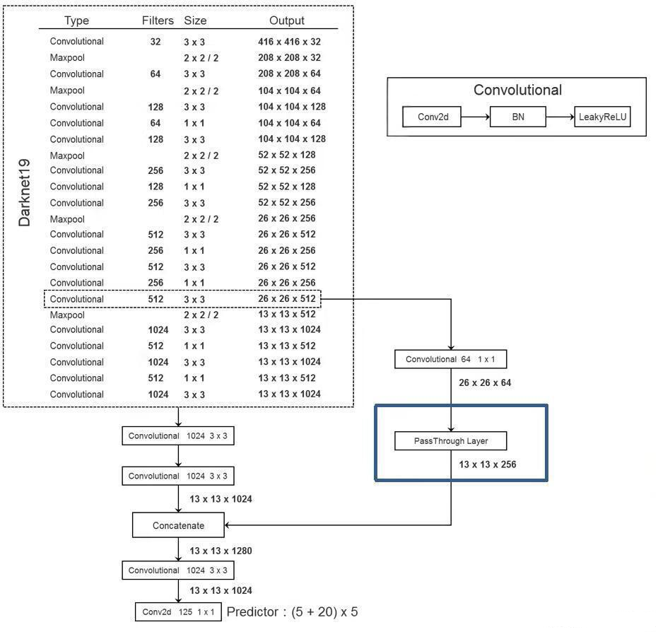
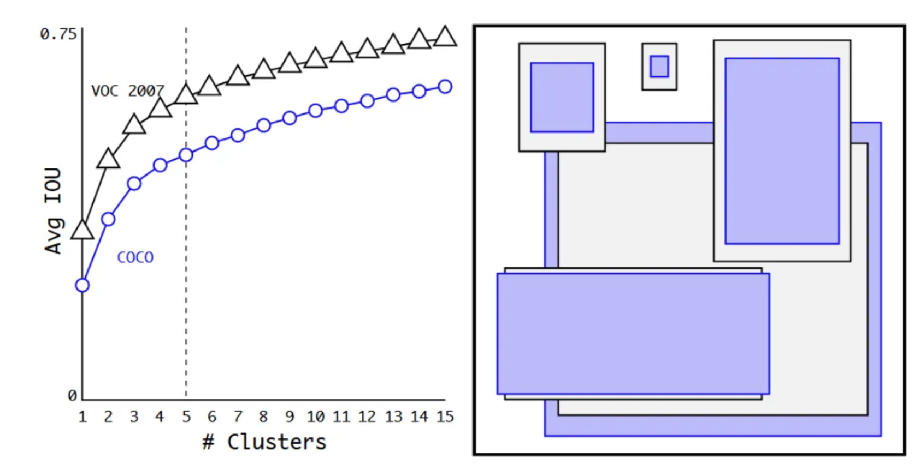

# YOLOv2 介绍
## 1. Yolov2 原理简介
相较于 YOLOv1，YOLOv2 围绕精度提升、速度保持、多类别适配三大方向做了一系列关键改进
### 1.1 锚框

#### 改进1：锚框（Anchor Boxes）
锚框是预设在特征图每个网格上的固定尺寸边框，YOLOv2 每个网格不再直接预测框的绝对尺寸，而是预测锚框的偏移量和缩放因子。每个网格预设 k 个锚框（YOLOv2 默认为 5 个）

#### 改进2：直接位置预测（Direct location prediction）
模型输出不再是直接的框坐标，而是锚框的 **x/y 偏移量**和**w/h 缩放因子**：
*  $t_x$ 、 $t_y$ 为模型预测的锚框中心坐标偏移量
*  $t_w$ 、 $t_h$ 为模型预测的锚框宽度、高度缩放因子

最终框坐标通过公式解码：
*  $b_x = \sigma(t_x) + c_x$ （ $c_x$ 为网格左上角 x 坐标， $\sigma(t_x)$ 限制偏移量在 0~1 之间）
*  $b_y = \sigma(t_y) + c_y$ （ $c_y$ 为网格左上角 y 坐标）
*  $b_w = p_w \cdot e^{t_w}$ （ $p_w$ 为锚框原始宽度， $t_w$ 为模型预测的宽度缩放因子）
*  $b_h = p_h \cdot e^{t_h}$ （ $p_h$ 为锚框原始高度， $t_h$ 为模型预测的高度缩放因子）

这种设计将**直接回归框尺寸**转化为**回归锚框的相对偏移**，大幅降低了回归难度，提升了框预测的稳定性。因此，输入一张图片，模型的输出为 $S \times S \times (k \times 5 + C)$，其中 $S$ 为特征图尺寸， $k$ 为每个网格预设的锚框数， $C$ 为类别数。
#### 3、维度聚类（Dimension Clusters）：找锚框的方法
传统锚框尺寸依赖人工经验设计（如 Faster R-CNN），YOLOv2 提出**基于 IoU 的 K-means 聚类**自动生成适配数据集的锚框：
* 从训练集中提取所有框的宽高（归一化到特征图尺寸）
* 使用k-means聚类方法选择k个锚框，兼顾召回率和模型轻量。选k=5
* 欧式距离改为 $1-IOU$ （防止大框影响过大）
<p align="center">
  
</p>
这种方法通过自动学习数据分布，无需手动设计，且能有效处理不同物体尺寸的问题。

### 1.2 网络架构
相较于V1，V2改GooleNet为Darknet-19，能够提取更丰富的特征，从而提升检测精度。删除了全连接层，仅保留卷积层。
#### 细粒度特征融合
将Darknet-19中第13层卷积输出（细粒度特征）与第19层卷积输出（粗粒度特征）通过 Passthrough 层融合，保留多尺度信息。

<p align="center">
  
</p>

由于只有卷积层，可输入不同尺寸图片（320–608，步长 32），网格数 $ S=\frac{图片尺寸}{32} $
## 2 本项目介绍
本项目使用 PyTorch 实现，适配二维码数据集（但类别）和植物大战僵尸数据集（多类别）进行训练。


## 算法概述
- 单阶段、端到端目标检测：将检测视为密集预测任务，在单个前向传播中同时输出位置、置信度与类别。
- Anchor 机制与直接位置预测：使用 K-Means（IoU 距离）聚类得到先验框（anchors），网络预测相对 anchor 的偏移；对中心坐标采用 Sigmoid 使其落在对应栅格内，训练更稳定。
- Darknet-19 骨干网络：轻量高效的 19 层卷积骨干，配合批归一化与 Leaky ReLU，在速度与准确率间取得良好折中。
- Passthrough（reorg）特征融合：将高分辨率特征重排后与低分辨率检测特征拼接，提升小目标性能。
- 多尺度训练：每隔若干迭代随机切换输入尺寸（320–608，步长 32），提升尺度泛化能力。
- 相比 YOLOv1 的主要优化：
  - 引入 anchors 与直接坐标预测（YOLOv1 直接回归绝对坐标，稳定性较差）。
  - 全面使用 BatchNorm，显著降低过拟合并提升收敛。
  - 高分辨率分类器预训练（先将分类器提升至 448，再迁移到检测）。
  - 特征融合与更优的骨干网络（Darknet-19），速度更快、精度更高。

## 技术细节
### 预测参数与核心公式
对每个栅格上的每个 anchor，网络输出：
\[
t_x,\, t_y,\, t_w,\, t_h,\, t_o,\; \{a_k\}_{k=1}^{C}
\]
其中 \(t_x, t_y\) 为中心偏移，\(t_w, t_h\) 为尺度偏移，\(t_o\) 为对象置信度的 logit，\(\{a_k\}\) 为各类别的 logit（C 为类别数）。将它们映射为实际量的公式如下：

- 边界框中心坐标（相对所在栅格的左上角）：
\[
b_x = \sigma(t_x) + c_x,\quad
b_y = \sigma(t_y) + c_y
\]
其中 \(\sigma(\cdot)\) 为 Sigmoid，\(c_x, c_y\) 为该栅格在特征图上的整数坐标。

- 边界框尺寸（相对 anchor 尺寸的指数缩放）：
\[
b_w = p_w \cdot e^{t_w},\quad
b_h = p_h \cdot e^{t_h}
\]
其中 \(p_w, p_h\) 为该 anchor 的先验宽高。

- 对象置信度（objectness）：
\[
p_{\text{obj}} = \sigma(t_o)
\]
在推理时常将“置信度”写作
\[
\text{conf} = p_{\text{obj}} \cdot \operatorname{IoU}(b, g)
\]
其中 \(g\) 为匹配的 GT 框；训练中 Darknet 实现通常以 IoU 或 1/0 目标为依据对 \(\text{conf}\) 进行回归与抑制无目标样本。

- 类别概率（Softmax）：
\[
p(k \mid \text{obj}) = \frac{e^{a_k}}{\sum_{j=1}^{C} e^{a_j}}
\]
最终每个类别的检测分数：
\[
s_k = \text{conf} \cdot p(k \mid \text{obj})
\]
后处理采用 NMS 抑制重叠框。

## 网络架构
### Darknet-19 骨干网络
- 设计思想：交替使用 \(3\times 3\) 与 \(1\times 1\) 卷积构建瓶颈结构，所有卷积层后接 BatchNorm 与 Leaky ReLU（负斜率约 0.1），下采样通过 \(2\times 2\) 最大池化。
- 典型结构（输入 \(416\times416\)）：
  - conv \(3\times3\), 32 → maxpool
  - conv \(3\times3\), 64 → maxpool
  - conv \(3\times3\), 128 → conv \(1\times1\), 64 → conv \(3\times3\), 128 → maxpool
  - conv \(3\times3\), 256 → conv \(1\times1\), 128 → conv \(3\times3\), 256 → maxpool
  - conv \(3\times3\), 512 → conv \(1\times1\), 256 → conv \(3\times3\), 512 → conv \(1\times1\), 256 → conv \(3\times3\), 512 → maxpool
  - conv \(3\times3\), 1024 → conv \(1\times1\), 512 → conv \(3\times3\), 1024 → conv \(1\times1\), 512 → conv \(3\times3\), 1024
- 分类任务末端接全局平均池化与全连接 Softmax；检测任务去掉分类头，接检测头与特征融合。

### 检测头与输出
- 在骨干末端追加若干卷积（如 \(3\times 3\) + \(1\times 1\)），最终输出通道数为 \(A \times (5 + C)\)，其中 A 为 anchor 数，5 表示 \((t_x,t_y,t_w,t_h,t_o)\)。
- 输出特征图尺寸约为 \(13\times 13\)（当输入为 \(416\times 416\)，下采样 32 倍）。

### 特征融合（Passthrough / reorg）
- 选择一层较高分辨率的特征图（例如 \(26\times26\times512\)），使用 reorg 操作将其按 \(2\times2\) 邻域重排为 \(13\times13\times2048\)。
- 与主干末端的 \(13\times13\times1024\) 检测特征在通道维拼接，得到 \(13\times13\times(1024+2048)\)。
- 再经 \(1\times1\) 卷积降维与 \(3\times3\) 卷积细化，最后输出检测张量。该融合显著提升小目标检测能力。

## 训练细节
### 输入尺寸
- 检测训练常用 \(416\times416\)；多尺度训练每隔若干迭代随机选择 \(\{320, 352, \dots, 608\}\)。
- 分类预训练先将输入提升至 \(448\times448\) 以获得更强的高分辨率特征。

### 数据增强
- 随机尺度与平移抖动（jitter），随机裁剪，水平翻转。
- 颜色扰动：HSV 颜色空间中对色相/饱和度/亮度进行随机扰动（常见幅度在 \(\pm 0.2\sim0.4\) 区间）。
- 随机填充与保持纵横比（letterbox）以适应不同输入尺寸。

### 损失函数
设正样本集合为 \(\mathcal{P}\)，\(\operatorname{IoU}_i\) 为第 \(i\) 个预测框与其 GT 的 IoU，\(\mathbf{p}_i\) 为类别概率，\(\mathbf{y}_i\) 为 one-hot 标签，整体损失：
\[
\begin{aligned}
L &= \lambda_{\text{coord}} \sum_{i \in \mathcal{P}}
\Big[(x_i - \hat{x}_i)^2 + (y_i - \hat{y}_i)^2 + (w_i - \hat{w}_i)^2 + (h_i - \hat{h}_i)^2\Big] \\
&\quad + \sum_i \Big[ \mathbf{1}_i^{\text{obj}} \big(\text{conf}_i - \operatorname{IoU}_i\big)^2
 + \lambda_{\text{noobj}} \mathbf{1}_i^{\text{noobj}} \big(\text{conf}_i - 0\big)^2 \Big] \\
&\quad + \sum_{i \in \mathcal{P}} \operatorname{CE}\big(\mathbf{p}_i, \mathbf{y}_i\big)
\end{aligned}
\]
- 常用权重：\(\lambda_{\text{coord}}=5\)、\(\lambda_{\text{noobj}}=0.5\)；正负样本的对象置信度分别以 IoU/0 为目标。
- 忽略阈值（ignore-thresh）：对与任一 GT IoU 较高的负样本（如 \(>0.6\)），在无目标项中不计入损失，缓解过抑制。

### 训练超参数（参考官方 Darknet 配置）
- 优化器：SGD，动量 0.9，权重衰减 0.0005。
- 学习率：初始 \(1\times10^{-3}\)（带若干百迭代的 warmup），分段衰减（如在 40k、45k 迭代处乘以 0.1）。
- 批大小与细分：batch 64，subdivisions 8 或 16（取决于显存）。
- Anchor 选择：对训练集 GT 尺寸做 K-Means（IoU 距离）得到 A 个 priors（如 A=5）。

## 性能指标
以下数据摘自“YOLO9000: Better, Faster, Stronger”（不同实现与硬件可能略有差异）：

### Pascal VOC 2007 测试集（训练于 07+12）
- YOLOv2 416：mAP ≈ 76.8，速度 ≈ 67 FPS（Titan X）
- YOLOv2 544：mAP ≈ 78.6，速度 ≈ 40 FPS
- YOLOv2 288：mAP ≈ 69.9，速度 ≈ 90+ FPS

### COCO test-dev
- AP@[.5:.95] ≈ 21–22
- AP50 ≈ 44
- 速度：以 416 输入在高端 GPU 上通常 40–60 FPS

### 与其他检测算法的对比（代表性结果）
- Faster R-CNN（ResNet-101，VOC07）：mAP ≈ 76.3，速度 ≈ 5 FPS
- SSD512（VOC07）：mAP ≈ 76–77，速度 ≈ 19 FPS
- 综合来看，YOLOv2 以显著更高的速度提供与两阶段方法相近的精度。

## 参考
- J. Redmon, A. Farhadi. YOLO9000: Better, Faster, Stronger. CVPR 2017.
- Darknet 官方实现与配置文件。

---

# 工程实现与使用指南

本工程完整复现了 YOLOv2 算法，基于 PyTorch 框架。以下是针对本工程代码的详细解读与使用教程。

## 1. 工程目录结构

```text
e:\my_workspace\yolo2\
├── config.yaml          # [核心配置] 训练超参数、路径、阈值、设备等统一配置文件
├── train.py             # [训练入口] 训练启动脚本，负责初始化和启动 Trainer
├── README.md            # [项目文档] 项目说明与原理介绍
├── visualize.py         # [可视化] 预测结果可视化脚本
├── data/                # [数据处理模块]
│   ├── anchor.py        # [Anchor 生成] 使用 K-Means 聚类生成数据集专属 Anchor
│   └── dataset.py       # [数据集] 图像加载、Letterbox 预处理、数据增强(ColorJitter/RandomCrop)
├── model/               # [模型核心模块]
│   ├── darknet.py       # [骨干网络] Darknet-19 网络实现
│   ├── yolov2.py        # [整体架构] YOLOv2 类，包含 Passthrough 层与检测头
│   └── loss.py          # [损失函数] 核心算法实现，包含坐标、置信度、类别损失计算
└── utils/               # [工具模块]
    ├── trainer.py       # [训练器] 封装训练循环、Checkpoint 管理、多尺度训练逻辑
    ├── logger.py        # [日志] 训练日志记录器
    └── utils.py         # [通用工具] IoU 计算、NMS、mAP 指标评估
```

## 2. 核心模块深度解析

### 2.1 数据准备 (`data/`)

*   **Anchor 生成 (`data/anchor.py`)**：
    *   YOLOv2 需要预先定义的 Anchor Box。本工程提供了 `kmeans` 算法，对训练集的所有 Ground Truth 框进行聚类。
    *   **原理**：使用 `1 - IoU` 作为距离度量，而非欧氏距离，确保 Anchor 形态更贴合真实物体。
    *   **产出**：生成 `yolov2_anchors.json`，训练时会自动加载。

*   **数据集处理 (`data/dataset.py`)**：
    *   **MyDataset 类**：负责读取图片和标签。
    *   **Letterbox**：为了适应正方形输入（如 416x416）且不改变物体长宽比，代码实现了 `_letterbox` 方法，将图片缩放并填充灰色边缘，同时自动调整 Label 坐标。
    *   **数据增强**：
        *   **颜色抖动**：随机调整亮度、对比度、饱和度、色调。
        *   **随机裁剪**：在训练时随机裁剪图片，并同步修正 Label 坐标（平移、Clamp、过滤）。

### 2.2 模型架构 (`model/`)

*   **Darknet-19 (`model/darknet.py`)**：
    *   实现标准的 Darknet-19 骨干，大量使用 `3x3` 卷积配合 `1x1` 瓶颈层，所有层后接 BN 和 Leaky ReLU。
    *   去掉了分类用的全连接层。

*   **YOLOv2 (`model/yolov2.py`)**：
    *   **ReorgLayer (Passthrough)**：实现特征重排，将浅层特征（如 26x26x512）拆分为（13x13x2048），以便与深层特征融合。
    *   **Forward 流程**：Backbone -> Passthrough 融合 -> 检测头卷积 -> 输出 `[B, A*(5+C), H, W]`。

*   **损失函数 (`model/loss.py`)**：
    *   **Target 构建**：`build_targets` 方法将 GT 框匹配到最佳 Anchor 和网格位置。
    *   **Loss 计算**：
        *   **Coord Loss**：MSE Loss，仅计算正样本，权重 `lambda_coord=5.0`。
        *   **Conf Loss**：
            *   正样本：趋向 1。
            *   负样本：趋向 0，权重 `lambda_noobj=0.5`。
        *   **Class Loss**：CrossEntropy Loss，仅计算正样本。

### 2.3 训练逻辑 (`utils/trainer.py`)

*   **Trainer 类**：管理整个训练生命周期。
*   **多尺度训练**：
    *   为了提升模型对不同分辨率的鲁棒性，Trainer 在每个 Epoch 开始时会随机选择一个输入尺寸（320 到 608 之间 32 的倍数）。
    *   代码：`current_img_size = random.choice(self.multi_scale_sizes)`。
*   **Checkpoint**：每隔 `save_interval` 个 Epoch 自动保存模型权重和优化器状态。

## 3. 快速上手指南

### 步骤 1：环境准备
确保安装 Python 3.8+ 及 PyTorch。
```bash
pip install torch torchvision opencv-python tqdm pyyaml
```

### 步骤 2：数据准备
将数据集按以下结构整理：
```
dataset/YourData/
├── train/
│   ├── images/  # .jpg / .png
│   └── labels/  # .txt (YOLO格式: class x y w h)
└── test/
    ├── images/
    └── labels/
```

### 步骤 3：配置参数
修改 `config.yaml` 文件：
```yaml
data_dir: "dataset/YourData"  # 指向你的数据集路径
num_classes: 20               # 修改为你的类别数
batch_size: 16                # 根据显存调整
epochs: 100
```

### 步骤 4：生成 Anchors
运行脚本生成适合你数据集的 Anchors：
```bash
python data/anchor.py
```
*注：`train.py` 也会在启动时尝试自动生成。*

### 步骤 5：开始训练
```bash
python train.py
```
训练过程中，可以在 `logs/` 目录下查看训练日志和 Checkpoints。

### 步骤 6：推理与可视化
使用 `visualize.py` 查看模型在测试集上的表现：
```bash
python visualize.py
```
该脚本会加载最新的模型，在测试集图片上绘制检测框并保存结果。
